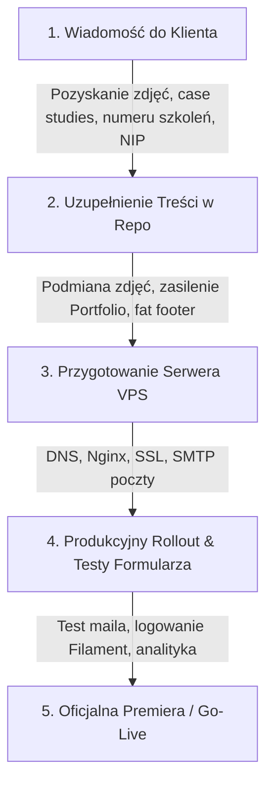

# Raport Stanu Projektu i Lista Braków do Ukończenia Strony Multiserwis Usługi

**Data audytu:** Sierpień 2026  
**Status techniczny projektu:** Gotowy frontend Astro + działające MVP backendu Laravel/Filament (lokalnie & preview)  
**Cel dokumentu:** Pełne podsumowanie historii prac, zrealizowanych modułów, statusu uwag klienta oraz kompletnej listy elementów brakujących do finalnego uruchomienia strony produkcyjnej.

---

## 1. Podsumowanie Historii i Ewolucji Projektu

1. **Punkt wyjścia:**
   - Stara strona `multiserwis.kutno.pl` oraz potrzeba rozdzielenia oferty usługowej od platformy szkoleniowej (`szkolenia-multiserwis.pl`).
   - Założenie: strona usługowa na nowoczesnym, błyskawicznym silniku, z silnym nastawieniem na konwersję (kontakt, telefon, formularz, WhatsApp) i wsparcie przemysłu / B2B.

2. **Architektura technologiczna (Stan docelowy):**
   - **Frontend:** Astro 5 + React 19 + Tailwind CSS 3 + Framer Motion (statyczny generator SSG dla maksymalnej szybkości i SEO).
   - **Backend operacyjny:** Laravel 13 w katalogu `backend/` z panelem administracyjnym **Filament 3** pod `/admin` (zarządzanie leadami, ustawieniami firmy, FAQ, usługami).
   - **Model publikacji:** Frontend statyczny pobiera dane z API lub z fallbackowych snapshotów JSON (`src/generated/`), co umożliwia podgląd na GitHub Pages bez konieczności działania publicznego backendu w fazie developmentu.

---

## 2. Co zostało już ZREALIZOWANE (Stan Faktyczny)

### 2.1. Frontend i Podstrony
- [x] **Strona Główna (`/`)**: Hero z paralaksą i dynamicznym tłem, sekcja "Dlaczego jedno źródło", kafelki usług z cross-sellem szkoleniowym, sekcja Uruchomień Elektrycznych, sekcja Konserwacji i UDT, duża sekcja Certyfikatu ISO 9001:2015, interaktywne FAQ oraz sekcja kontaktowa.
- [x] **Wynajem Maszyn (`/wynajem`)**: Pełna lista sprzętu z podziałem na kategorie (Podesty, Żurawie, Ładowarki, Sprzęt specjalistyczny), wyróżniony boks "Najczęściej zamawiany sprzęt", modele wynajmu (z operatorem / bez), baner uprawnień UDT i odesłanie do relokacji.
- [x] **Relokacja Maszyn (`/relokacja`)**: 6-etapowy proces relokacji (Demontaż → Załadunek → Transport → Rozładunek → Montaż → Rozruch), boks korzyści ("Dlaczego my") oraz odesłanie do wynajmu maszyn.
- [x] **Konserwacja i UDT (`/udt`)**: Rejestracja i formalności, konserwacja, doradztwo techniczne, wykaz obsługiwanych urządzeń (wózki, podesty, żurawie, naczepy, windy), baner szkoleń UDT/IMBIGS.
- [x] **Usługi Spawalnicze (`/spawanie`)**: Naprawy bieżące, konstrukcje stalowe (antresole, podesty, ramy, podstawy pod wentylatory, zabudowy akustyczne), technologie i materiały, link do kursów spawalniczych.
- [x] **Hydraulika i Montaż Przemysłowy (`/budownictwo`)**: Rurociągi przemysłowe (spawane, zgrzewane, skręcane), montaż konstrukcji wsporczych, armatura, prace na czynnych obiektach.
- [x] **Usługi Elektryczne (`/elektryka`)**: Prace kontrolno-pomiarowe (transformatory, silniki, rozdzielnice nn/SN), koordynacja rozruchów technologicznych, elektroinstalacje przemysłowe, szkolenia SEP (G1, G2, G3).
- [x] **Usługi Techniczne (`/uslugi-techniczne`)**: Podstrona zbiorcza łącząca spawalnictwo, UDT i relokację.
- [x] **O Firmie (`/o-firmie`)**: Opis profilu działalności, wartości firmy, pełna sekcja Certyfikatu ISO 9001:2015 PCA AC 136 wraz ze szczegółowym zakresem akredytacji.
- [x] **Centrum Pomocy FAQ (`/faq`)**: Wyszukiwarka na żywo, filtr kategorii (Wszystkie, Ogólne, Wynajem, UDT, Elektryka i Spawanie, Relokacja, Budownictwo, Kontakt), akordeony pytań.
- [x] **Kontakt (`/kontakt`)**: Pełne dane teleadresowe, godziny pracy biura (8:00–16:00), bezpośrednie przyciski połączeń, integracja WhatsApp dla numerów usług, interaktywna mapa dojazdu Google Maps.
- [x] **Realizacje (`/realizacje`)**: Szablon podstrony portfolio z podziałem na 4 główne filary.
- [x] **Strony formalne i systemowe**: Polityka Prywatności (`/polityka-prywatnosci`), Regulamin serwisu (`/regulamin`), dedykowana strona błędu `404` (`/404`).

### 2.2. Interakcja, UX i Konwersja
- [x] **Formularz kontaktowy (`ContactForm.tsx`)**:
  - Obsługa standardowych zapytań ogólnych oraz dedykowany tryb dla *Wynajmu Maszyn* (pola: rodzaj sprzętu, lokalizacja, termin, orientacyjny czas wynajmu, opcja z operatorem/bez).
  - Ochrona antyspamowa (honeypot `website`).
  - Walidacja pól po stronie klienta i obsługa stanów (ładowanie, sukces, błąd).
  - Przygotowana pełna integracja z API Laravel (`POST /api/v1/leads`).
- [x] **Nawigacja i Mobilność**:
  - Sticky navbar z efektem blur przy scrollu.
  - Dropdowny dla kategorii usług.
  - Płynne menu mobilne z blokadą scrollowania tła (`overflow: hidden`).
  - Przycisk WhatsApp na mobile i desktopie.

### 2.3. SEO i Wydajność
- [x] Znaczniki Canonical, Open Graph (OG), Twitter Card.
- [x] Automatyczny generator `robots.txt` zależny od środowiska (`preview` vs `production`).
- [x] Sitemap XML generowany przez `@astrojs/sitemap`.
- [x] Dane strukturalne Schema.org JSON-LD dla organizacji i usług.
- [x] Zerowe błędy kompilacji (`astro check` & `npm run build` przechodzą w 100%).

### 2.4. Backend (Laravel 13 + Filament 3)
- [x] Baza danych SQLite i migracje dla: `leads`, `site_settings`, `faq_items`, `service_offerings`.
- [x] Panel Filament pod `/admin` z uwierzytelnianiem i zarządzaniem:
  - Leadami (statusy: *new*, *in_progress*, *contacted*, *closed*, *spam*, notatki handlowe).
  - Danymi kontaktowymi firmy i globalnymi meta-tagami SEO.
  - Bazą pytań FAQ i kategoriami.
  - Katalogiem usług i ofertą cross-sellingu szkoleń.
- [x] Narzędzie eksportu snapshotów do repozytorium: `npm run backend:export-preview`.
- [x] Gotowy pakiet wdrożeniowy na serwer VPS w `deploy/vps/` (szablony Nginx, timery systemd, skrypty backupu bazy SQLite i rollbacku).

---

## 3. Status Uwag Zgłoszonych w Projekcie

### 3.1. Uwagi Martyny (`uwagi_Martyny.md`) – Rozliczenie:
| Lp. | Temat uwagi | Co zrobiono | Status |
|:---|:---|:---|:---:|
| **1.2** | Wynajem: wyróżnienie najpopularniejszego sprzętu + dopisek o dowolnym sprzęcie | Dodano ramkę "Najczęściej zamawiany sprzęt" oraz komunikat o doborze indywidualnym na podstronie `/wynajem` | **Zrobione** ✅ |
| **1.4** | Osprzęt pomocniczy (trawersy, rolki, stemple, przedłużki) – nie wynajmujemy osobno, lecz używamy przy usługach | Uwzględniono w opisach oferty i w formularzu zapytania | **Zrobione** ✅ *(czeka tylko na ew. detale od Kamila)* |
| **2.2** | Spawalnictwo: suwnica K4, ramy pod wentylatory, wsporniki pod rurociągi, zabudowy akustyczne | Dopisano szczegółowe elementy do listy realizacji w `WeldingPage.tsx` | **Zrobione** ✅ |
| **2.3** | Technologie spawania i gatunki stali | Dodano blok z metodami (MIG/MAG, TIG, MMA) i stalami (czarna, kwasówka, aluminium) | **Zrobione** ✅ |
| **3.0** | Relokacja: linkowanie do wynajmu i odwrotnie | Dodano dwukierunkowe boksy cross-sell pomiędzy podstronami `/relokacja` i `/wynajem` | **Zrobione** ✅ |
| **4.0** | Usługi hydrauliczne i montażowo-konstrukcyjne zamiast ogólnego budownictwa | Przemodelowano podstronę `/budownictwo` na "Usługi Hydrauliczne i Montażowo-Konstrukcyjne" | **Zrobione** ✅ |
| **5.1** | UDT: windy samochodowe / podesty załadowcze | Dodano do listy obsługiwanych urządzeń w `UdtPage.tsx` i `UdtSection.tsx` | **Zrobione** ✅ |
| **5.3** | Serwis i diagnostyka mechaniczna/hydrauliczna/elektryczna | Dodano dedykowaną sekcję "Kompleksowy serwis i diagnostyka" | **Zrobione** ✅ |
| **7.0** | Formularz wariant B (pola: opis prac, parametry ładunku, opcja z operatorem) | Zaimplementowano w `ContactForm.tsx` jako rozszerzone pola dla wynajmu | **Zrobione** ✅ |
| **13.3** | Godziny pracy biura: 8:00 - 16:00 | Zaktualizowano w `company.ts`, na stronie głównej i w kontakcie | **Zrobione** ✅ |
| **13.8** | Numery telefonów do usług: 730 101 000, 733 929 100 | Wdrożono oba numery w nagłówku, stopce, boksach kontaktowych i danych firmy | **Zrobione** ✅ |
| **13.9** | WhatsApp do numerów usług | Wdrożono bezpośrednie linki WhatsApp (`wa.me/48730101000`) | **Zrobione** ✅ |
| **13.10**| FAQ: Usunięcie błędnego wpisu o przypomnieniach UDT i pytania o ubezpieczenie | Usunięto z bazy pytań i ze snapshotów | **Zrobione** ✅ |

---

## 4. Czego DOKŁADNIE Brakuje do Dokończenia Projektu?

Braki podzielono na 4 logiczne grupy:
1. **Materiały i decyzje od Klienta** (treści, zdjęcia, weryfikacje)
2. **Uzupełnienia w kodzie i treściach** (spójność snapshotów i portfolio)
3. **Infrastruktura i wdrożenie produkcyjne VPS** (domena, maile, serwer)
4. **Analityka i marketing startowy**

---

### GRUPA 1: Materiały i Informacje od Klienta (Blokery Treściowe)

To są elementy, których nie da się wymyślić programistycznie bez wsadu od firmy Multiserwis:

1. 🔴 **Prawdziwe zdjęcia realizacji i parku maszynowego**:
   - **Stan obecny:** Strona korzysta ze stockowych zdjęć Unsplash oraz wygenerowanego tła hero. Podstrona `/realizacje` nie ma zdjęć.
   - **Co jest potrzebne:**
     - 5–15 dobrej jakości zdjęć maszyn w akcji (żurawie, podesty, wózki, relokacje linii produkcyjnych, spawanie hal/antresol).
     - Zdjęcie bazy/siedziby w Kutnie (opcjonalnie do "O firmie" / "Kontakt").

2. 🔴 **Przykłady konkretnych realizacji (Case Studies do `/realizacje`)**:
   - **Stan obecny:** Na podstronie `/realizacje` widnieje komunikat techniczny: *"Sekcja do uzupełnienia z klientem"*.
   - **Co jest potrzebne:** 2–4 krótkie opisy wykonanych prac, np.:
     - *Klient / branża:* Zakład motoryzacyjny / spożywczy / magazyn.
     - *Zakres:* Relokacja 3 pras hydraulicznych o masie 25t + podłączenie mediów.
     - *Użyty sprzęt:* Żuraw 60t, rolki transportowe, podnośnik.

3. 🟡 **Doprecyzowanie osprzętu przez Kamila (Sekcja 1.4 / Relokacje)**:
   - **Stan obecny:** Ogólny zapis: trawersy, rolki transportowe, stemple, przedłużki wideł.
   - **Co jest potrzebne:** Ostateczna akceptacja lub dopisanie specyficznych narzędzi (np. lewary hydrauliczne, siłowniki niskoprofilowe, zawiesia pasowe/łańcuchowe).

4. 🟡 **Weryfikacja merytoryczna podstrony Elektryka (`/elektryka`)**:
   - **Stan obecny:** Przygotowano opisy pomiarów nn/SN, transformatorów, rozdzielnic i prac rozruchowych.
   - **Co jest potrzebne:** Krótkie "OK" od Kamila, czy ten zakres w 100% odpowiada uprawnieniom i profilowi zleceń firmy.

5. 🟡 **Dedykowany numer telefonu do Szkoleń (lub decyzja o braku)**:
   - **Stan obecny:** W kodzie znajduje się placeholder `730 202 000` (w kontakcie odsyłamy na stronę szkoleniową).
   - **Co jest potrzebne:** Podanie docelowego numeru do działu szkoleń lub decyzja o usunięciu numeru telefonicznego szkoleń ze strony usług i pozostawieniu wyłącznie linku www.

6. 🟢 **Dane rejestrowe do stopki / regulaminu**:
   - **Co jest potrzebne:** Dokładny NIP, REGON, ewentualnie KRS oraz pełna nazwa podmiotu prawnego do wpisania w polityce prywatności i stopce.

---

### GRUPA 2: Zadania Programistyczne i Treściowe (Do wykonania w repo)

1. 🟡 **Uzupełnienie podstrony Portfolio (`src/screens/PortfolioPage.tsx`)**:
   - Zastąpienie klocka z punktami roboczymi realną siatką projektów / kartami realizacji (z miniaturami zdjęć i opisem po otrzymaniu materiałów od klienta).

2. 🟡 **Ujednolicenie nazwy usługi budowlano-montażowej w backendzie**:
   - W `backend/app/Models/ServiceOffering.php` oraz `site-content.snapshot.json` zaktualizować tytuł pozycji `slug: budownictwo` z dawnego *"Remonty Budowlane"* na *"Hydraulika i Montaż Przemysłowy"*, aby panel Filament i snapshoty były w 100% spójne z frontendem.

3. 🟢 **Rozbudowa stopki (`Footer.tsx`)**:
   - Obecna stopka jest bardzo skromna (tylko prawa autorskie + 2 linki prawne). Warto dodać klasyczną siatkę z linkami do kluczowych usług, danymi adresowymi i numerami telefonów (tzw. "fat footer" poprawiający SEO i indeksację).

---

### GRUPA 3: Wdrożenie Produkcyjne na Serwer VPS (Infrastruktura)

To zadania niezbędne, aby strona zaczęła działać pod docelową domeną klienta, a formularze wysyłały maile:

1. 🔴 **Podpięcie domeny i DNS**:
   - Skierowanie domeny głównej (np. `multiserwis.kutno.pl` lub nowej domeny) na adres IP docelowego serwera VPS.
   - Konfiguracja subdomen technicznych:
     - `api.multiserwis.kutno.pl` (dla API formularzy)
     - `admin.multiserwis.kutno.pl` (dla panelu Filament)

2. 🔴 **Wdrożenie konfiguracji Nginx i certyfikatów SSL**:
   - Zastosowanie przygotowanych szablonów z `deploy/vps/nginx/`.
   - Wygenerowanie bezpłatnych certyfikatów SSL przez Certbot (Let's Encrypt) dla domeny głównej i subdomen.

3. 🔴 **Konfiguracja wysyłki wiadomości E-mail (SMTP)**:
   - **Kluczowy element:** Skonfigurowanie w pliku `.env` backendu Laravel parametrów SMTP (np. host poczty, login, hasło, port), aby po wysłaniu formularza przez klienta:
     1. Natychmiast szedł e-mail z powiadomieniem do biura Multiserwis (`multiserwis.kutno@gmail.com`).
     2. Opcjonalnie szło automatyczne potwierdzenie do osoby wysyłającej zapytanie.

4. 🟡 **Uruchomienie automatycznego deployu (GitHub Actions)**:
   - Wpisanie sekretów w repozytorium GitHub: `VPS_HOST`, `VPS_SSH_USER`, `VPS_SSH_PRIVATE_KEY`.
   - Przetestowanie workflow `.github/workflows/deploy-production.yml`.

5. 🟢 **Aktywacja backupów i monitoringu na serwerze**:
   - Włączenie przygotowanych timerów systemd (`multiserwis-backup.timer`, `multiserwis-healthcheck.timer`).

---

### GRUPA 4: Analityka i Czynności Po-Wdrożeniowe (Go-Live)

1. 🟢 **Podpięcie docelowej analityki**:
   - Wpisanie produkcyjnego identyfikatora Umami (`PUBLIC_UMAMI_WEBSITE_ID` i `PUBLIC_UMAMI_SCRIPT_URL`) lub wpięcie Google Analytics 4 (jeśli klient preferuje GA4).
2. 🟢 **Google Search Console**:
   - Zgłoszenie nowej domeny i sitemapy (`/sitemap-index.xml`) w Google Search Console po premierze.
3. 🟢 **Przekierowania ze starej strony (301 Redirects)**:
   - Jeśli na starej domenie istniały zaindeksowane podstrony, przygotowanie mapy przekierowań 301 w Nginx, aby nie stracić dotychczasowych pozycji w Google.

---

## 5. Podsumowanie i Rekomendowany Plan Działania

Projekt jest w **bardzo zaawansowanym stanie technicznym (ok. 85-90% całości)**. Fundament kodowy, stylistyka, responsywność, SEO, panel administracyjny i API są w pełni sprawne i zweryfikowane.

### Następne kroki (w kolejności priorytetu):

1. **Wysłanie do klienta krótkiego podsumowania z prośbą o wsad:**
   - Paczka zdjęć maszyn / realizacji
   - 2-3 przykłady prac do sekcji Realizacje
   - Docelowy numer do szkoleń (lub potwierdzenie linkowania)
   - Pełne dane spółki (NIP, adres formalny)
2. **Wdrożenie otrzymanych materiałów do repozytorium.**
3. **Uruchomienie instancji produkcyjnej na serwerze VPS ze skonfigurowaną pocztą e-mail.**
4. **Finalne testy formularza i oficjalny start.**
